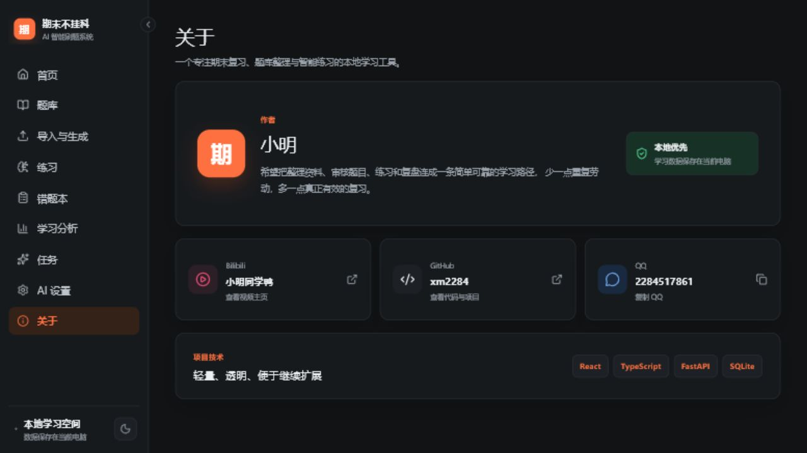

# 期末不挂科

> 大学生期末复习、AI 题库生成与智能刷题平台

[](https://react.dev/)
[](https://www.typescriptlang.org/)
[](https://vitejs.dev/)
[](https://fastapi.tiangolo.com/)
[](https://www.sqlite.org/)
[](LICENSE)

一个本地优先的单用户学习系统，把“整理资料 → 生成题目 → 人工审核 → 刷题 → 错题复盘 → 学习分析”连接成完整闭环。

系统支持解析已有试题，也可以通过 OpenAI-compatible API 根据课程资料生成题目。所有生成内容都会先进入审核区，不会未经确认直接发布。


## 功能亮点

### 题库生产

- 支持 TXT、Markdown、DOCX、CSV、JSON 和文字版 PDF
- 支持粘贴文本或上传文件
- 自动根据课程名或上传文件名生成题库名称
- 支持有序号与无序号题目识别
- 本地规则低置信度时使用 AI 辅助整理题目边界和排版
- AI 根据课程大纲、课堂笔记和教材章节生成复习题
- 所有解析与生成结果先进入人工审核区
- 支持逐题编辑、删除、批量通过、发布和 JSON 导出


### 智能练习

- 顺序练习、乱序练习、错题练习和收藏题练习
- 自动保存题目顺序、当前位置和完成状态
- 客观题即时判分
- 主观题支持 AI 评分和反馈
- AI 不可用时进入待自评状态，不阻塞练习
- AI 讲解采用流式输出，减少长时间空白等待
- 单题收藏、错题累计和针对性重练

### 学习分析

- 近七天作答趋势
- 课程正确率对比
- 题型表现
- 知识点掌握度
- 练习时长、累计作答和活跃天数
- 薄弱知识点与高频错题统计

### 界面体验

- 桌面端可折叠侧边栏
- 手机端底部核心导航和“更多”抽屉
- 浅色、暗色和跟随系统三种主题
- 主题偏好自动保存在浏览器
- 卡片、表单、题目选项、状态反馈和图表均适配暗色模式



## 技术栈

| 层级 | 技术 |
| --- | --- |
| 前端 | React 19、TypeScript、Vite |
| UI | CSS Variables、Lucide Icons |
| 图表 | Recharts |
| 后端 | FastAPI、SQLAlchemy |
| 数据库 | SQLite |
| AI | OpenAI-compatible Chat Completions |
| 测试 | Pytest、Vitest、ESLint、TypeScript |

## 项目结构

```text
.
├─ backend/
│  ├─ app/
│  │  ├─ api/          # FastAPI 路由
│  │  ├─ models/       # SQLAlchemy 模型
│  │  ├─ schemas/      # Pydantic 数据结构
│  │  └─ services/     # AI、解析、练习和任务服务
│  ├─ tests/
│  └─ requirements.txt
├─ frontend/
│  ├─ src/
│  │  ├─ api/
│  │  ├─ components/
│  │  ├─ pages/
│  │  └─ theme/
│  └─ package.json
├─ docs/images/        # README 界面截图
└─ README.md
```

## 快速开始

### 环境要求

- Python 3.11 或更高版本
- Node.js 20 或更高版本
- npm

### 1. 克隆项目

```bash
git clone https://github.com/xm2284/FinalExamHelper.git
cd FinalExamHelper
```

### 2. 启动后端

```powershell
cd backend
python -m pip install -r requirements.txt
python -m uvicorn app.main:app --host 127.0.0.1 --port 8000
```

后端接口文档：

```text
http://127.0.0.1:8000/docs
```

### 3. 启动前端

新开一个终端：

```powershell
cd frontend
npm install
npm run dev -- --host 127.0.0.1 --port 5173
```

浏览器访问：

```text
http://localhost:5173
```

## AI 配置

进入系统中的“AI 设置”，填写：

- API Base URL
- API Key
- 模型名称
- Temperature

接口需兼容 OpenAI Chat Completions：

```text
POST {API_BASE_URL}/chat/completions
```

项目支持自定义服务地址和模型，不绑定特定 AI 平台。

## 数据与密钥安全

- API Key 只写入本机 SQLite 数据库
- 前端接口仅返回脱敏后的 Key
- SQLite 数据库不会提交到 GitHub
- 上传的课程资料不会提交到 GitHub
- `.env`、本地配置、构建产物和依赖目录均已加入 `.gitignore`
- 发布仓库前已清除开发数据库中保存的 API Key

请勿把真实 API Key 写入源码、README、Issue 或提交记录。

## 支持的题目格式

推荐文本格式：

```text
HTML 的主要作用是什么？
A. 描述网页结构
B. 管理数据库
C. 编译操作系统
D. 训练模型
答案：A
解析：HTML 用于描述网页结构。
知识点：HTML 基础、网页结构
```

题目可以带题号，也可以不带题号。解析器会结合选项、答案、解析、空行和题目结构判断边界；当本地识别不完整且已配置 AI 时，会尝试进行结构化整理。

## 测试

后端：

```powershell
cd backend
python -m pytest -q
```

前端：

```powershell
cd frontend
npm test
npm run lint
npm run build
```

当前验证结果：

- 后端：17 项测试通过
- 前端：10 项测试通过
- ESLint：通过
- TypeScript + Vite 生产构建：通过

## 当前限制

- 扫描版 PDF 暂不支持 OCR
- 当前定位为本地单用户系统，不包含注册登录
- 后台任务使用本地线程池，不依赖 Redis 或 Celery
- SQLite 适合课程项目与本地使用，大规模多人部署建议迁移 PostgreSQL

## 作者

- Bilibili：[小明同学鸭](https://space.bilibili.com/570049863)
- GitHub：[xm2284](https://github.com/xm2284)
- QQ：2284517861

